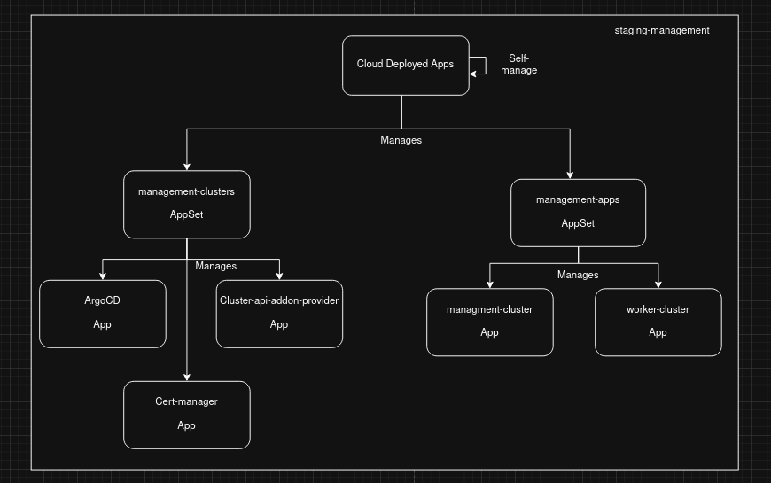
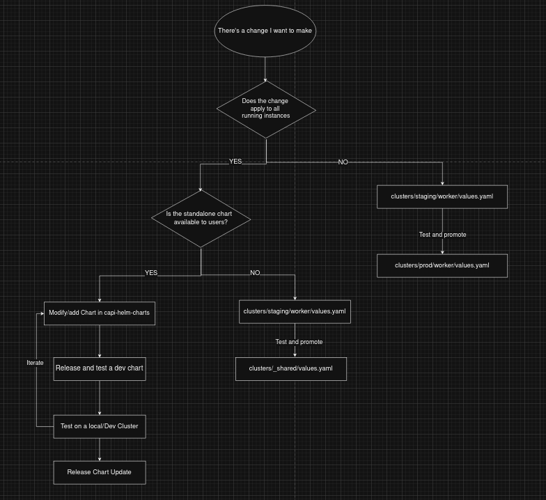

# Folder-based GitOps using ArgoCD

This repository uses the "folder-based" gitOps methodology. 

You can learn more here:
- [Stop Using Branches for Deploying to Different GitOps Environments](https://codefresh.io/blog/stop-using-branches-deploying-different-gitops-environments/)
- [How to Model Your GitOps Environments and Promote Releases between Them](https://codefresh.io/blog/how-to-model-your-gitops-environments-and-promote-releases-between-them/)

The structure of how ArgoCD applications are built can be seen in this diagram

We use argoCD `ApplicationSet` to deploy our apps and infrastructure. 
[see ApplicationSet spec](https://argo-cd.readthedocs.io/en/stable/operator-manual/applicationset/applicationset-specification/)

# Promotion Workflow

"Promotion" refers to how our development cycle works.

When we want to make a change to one of our apps/charts - we follow this promotion flowchart:

